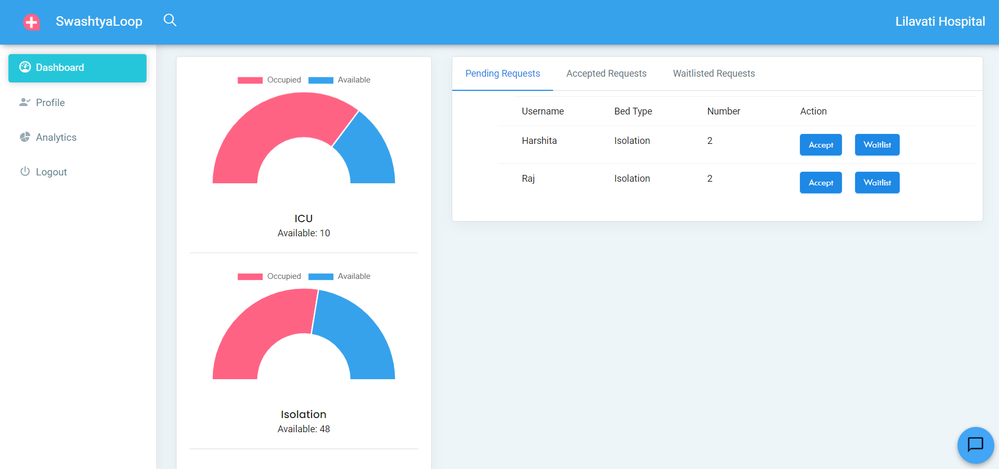
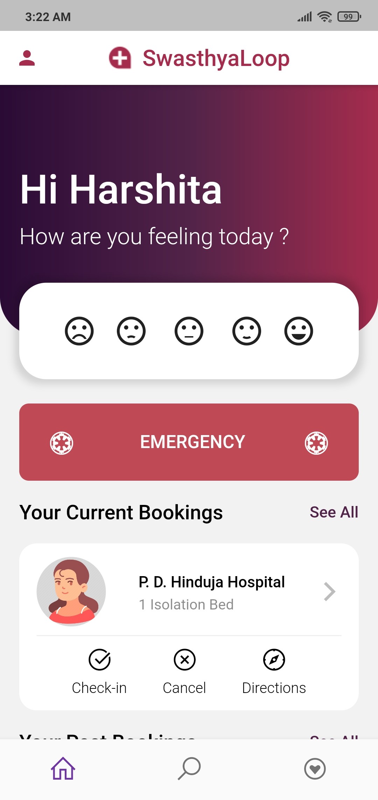
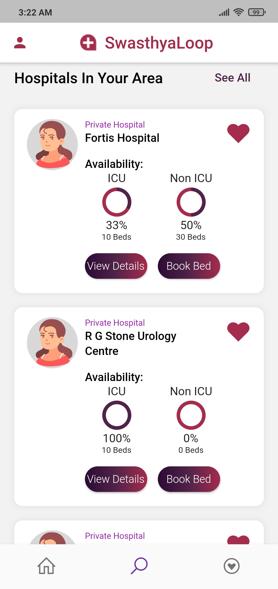
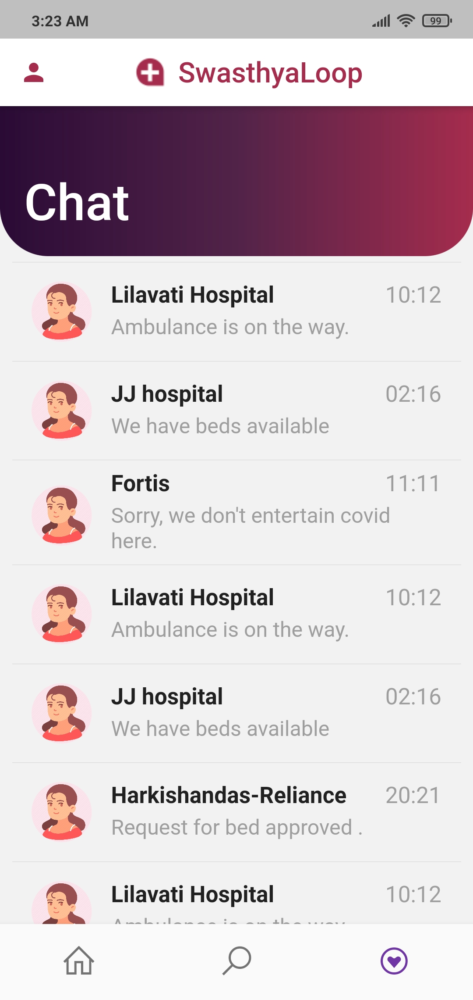

<p align="center">
  <a href="#" rel="noopener">
 </a>
</p>

<center>

[](https://www.python.org/)
[](https://www.python.org/)

[](https://github.com/sindresorhus/awesome#readme)

</center>

<hr>

## About

*__This project tries to solve for Good Health & Wellbeing, which is one of the United Nations Sustainable Development Goals working towards eliminating the struggle of availing medical treatment during the time of need. Due to COVID and even otherwise, getting hospital beds is really difficult, at least in a crowded city like Mumbai.__*

<hr>

## What are we making

Here's our demo video

[](https://youtu.be/mKNpqt8nPXE)

<hr>

## How to run

#### Setting up the environment

- Firebase project setup
    - Create an app on firebase
    - Follow the official guide for android and ios to integrate with the flutter app
    - Download `firebase_key.json` (yes, rename it to firebase_key.json) and paste it in `web/env`
    - Create a `.env` file in the same (`web/env`) folder with the following contents:
        - ```
            # leave firebase_key as it is
            firebase_key=env/firebase_key.json
            firebase_route=<YOUR-FIREBASE-ROUTE>
            ```

#### Backend and Hospital Web App

- ```sh 
        # First let's install the dependencies
        cd backend
        pip install -r requirements.txt
        # Now let's start our db server
        python fb_db.py
        # Finally, the web app
        python run.py
    ```

- Now, after successfully running the db server, you'll see `{"status": "fine"}` messagge on `http://127.0.0.1:8080`

- And once the flask app starts, please visit `http://127.0.0.1:5000/`, after login, you'll see a dashboard as follows:
    


### Flutter App

- The base directory is `app/swasthyaloop`
- Open the folder in any ide of your choice, connect your phone/emulator and run the `main.dart` file.

*PS: Grab a cup of coffee, it takes some time to build*

- Once the app is built successfully, you'll see a welcome screen and post login:
<p  align = "center">
 <table>
   <tr>
    <td></td>
    <td></td>
    <td></td>
  </tr>
</table>
</p>

<hr>

### Contributors
- [Dhruv-Sachdev1313](https://github.com/Dhruv-Sachdev1313)
- [Harshita-Kanal](https://github.com/Harshita-Kanal)
- [shintan777](https://github.com/shintan777/)
-  [ADI10HERO](https://github.com/adi10hero/)

<hr>

## Recognition
This repository/project is a submission to [DSC Solution Challenge 2021](https://developers.google.com/community/dsc-solution-challenge).

## References
- [Hospital Capacity and Availability Info](https://arogya.maharashtra.gov.in/pdf/Cat%20I%20Facility%2020%20March%202021.pdf) 
- List of Prominent Hospitals in Mumbai, i.e. Our [Hospital Dataset](https://arogya.maharashtra.gov.in/1166/List-of-Prominent-Hospitals-in-Mumbai?format=print)
- [Flutter App UI Motivation](https://github.com/mlayah/healthapp_ui)
- [Jinja Material Lite Wpx](https://appseed.us/jinja-template/jinja-template-material-lite)

<center>
<footer>
Made with ❤️ by Team <strong>Change Makers</strong>
</footer>
</center>